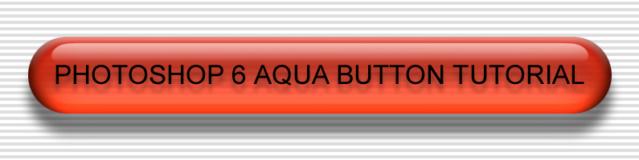

# AquaButton

A step-by-step **Adobe Photoshop 6** tutorial for creating an Aqua-style button, illustrated with screenshots from each stage of the process.



## GitHub Pages

This repository is arranged so the tutorial can be published directly from the `docs/` directory.

## Repository layout

```text
aquabutton/
├── README.md
└── docs/
    ├── .nojekyll
    ├── index.html
    ├── assets/
    │   └── aquabutton.css
    └── images/
        ├── title.jpg
        └── step*.jpg
```

## Notes

The tutorial was written for Photoshop 6, so menu names and controls may differ in later Photoshop releases.

## Author

P. David Buchan
